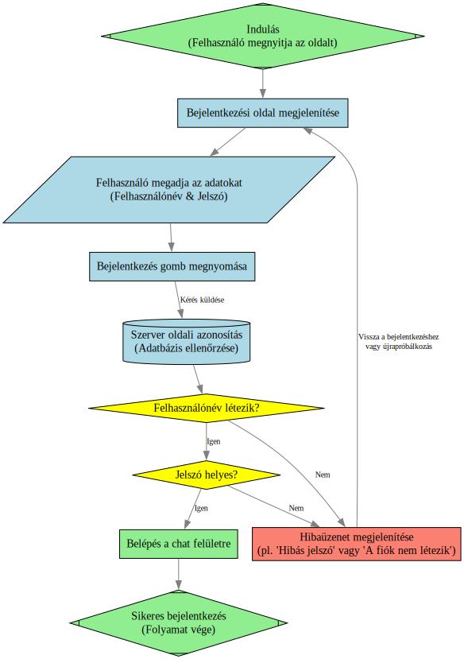
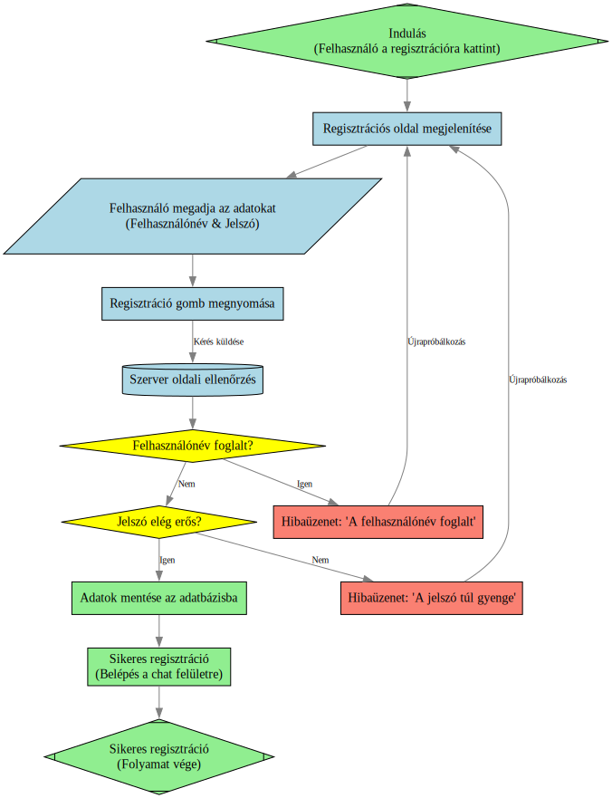

# Rendszerterv

## Rendszer célja
Egy modern, felhasználóbarát üzenetküldő alkalmazás létrehozása, amely megbízható, hatékony és biztonságos kommunikációt tesz lehetővé felhasználók között. 

Valós idejű üzenetküldés lehetővé teszi azonnali üzenetek küldését és fogadását, hogy a felhasználók gyorsan tudjanak kommunikálni. Ez magában foglalja az üzenetek sorba rendezését, az olvasási visszaigazolások, illetve az üzenet státuszok kezelését (pl. elküldve, kézbesítve, olvasva).

Biztosítani kell, hogy minden felhasználó regisztrálva legyen, azonosítható legyen egyedi azonosítóval (pl. felhasználónév vagy e-mail), valamint biztonságos módon tudjon bejelentkezni (pl. jelszóval, tokennel).

Az adatok védelme kulcsfontosságú: üzenetek titkosítása (akár átvitel közben, akár tárolás közben), és az érzékeny adatok kezelése megfelelő biztonsági intézkedésekkel. Ezzel a felhasználói bizalom növekszik, és elkerülhetők az adatvédelmi incidensek.

Az üzenetek és kapcsolódó metaadatok (pl. időpont, feladó, címzett, státusz) tárolása, hogy a felhasználók visszanézhessék a korábbi beszélgetéseket. Ugyanakkor gondoskodni kell arról, hogy az adattárolás hatékony legyen, és az adatvédelem szempontjai figyelembe legyenek véve.

## A rendszerrel szemben támasztott általános követelmények

- A rendszer funkcióit csak bejelentkezett felhasználó használhatja.
- Webes felület React-tal
- Funkciókat Node.js-el
- Adattárolás PostgreSQL adatbázison

## Az alkalmazásokkal szemben támasztott funkcionális követelmények

- Felhasználókezelés
- Üzenetküldés lebonyolítása
- Kommunikációs felület kiszolgálása

## Funkcionális követelmények

### Frontend felépítése

#### A frontend a React.js és a Material-UI kombinációjára épül, ami hatékony és esztétikus felhasználói felületet (UI) tesz lehetővé.

 - React.js előnyei
    - Komponensalapú architektúra: A UI elemek, mint a bejelentkezési űrlapok, a chatablakok és a felhasználói listák, független, újrahasználható komponensekként kezelhetők.
    - Hatékony állapotkezelés: A React useState és más hookok segítségével dinamikusan frissíthető a felület az adatok változásakor (pl. új üzenet érkezésekor).

 - Material-UI előnyei
    - Gyors fejlesztés: Kész, testreszabható UI komponensek (pl. Button, TextField, List, Grid) állnak rendelkezésre, így nem kell mindent a nulláról megírni.
    - Reszponzív design: A komponensek alapvetően reszponzívak, így a felület jól mutat különböző eszközökön és képernyőméreteken.
    - Professzionális kinézet: A Google Material Design elveire épülő elemek egységes és modern megjelenést biztosítanak.

#### A felület felépítése és a technológiák kapcsolódása

A rendszerterv alapján a felület a következő fő részekre osztható, a React és Material-UI komponensek használatával:

 - Bejelentkezés/Regisztráció oldal:
    - TextField komponensek a felhasználónév és jelszó beviteléhez.
    - Button komponensek a bejelentkezés és a regisztráció gombokhoz.
    - A beviteli adatok a Node.js API-nak kerülnek elküldésre, ami hitelesíti a felhasználót, és JWT tokent ad vissza.

 - Fő oldal:
    - Elrendezés: A Grid és a Paper komponensekkel lehet kialakítani a bal oldali menüt és a jobb oldali chatablakot.
    - Bal oldali menü:
        - List vagy MenuItem komponensek a barátok, értesítések és beállítások listázásához.
        - A felhasználói profilkép megjelenítéséhez Avatar komponens használható.

 - Középső/Jobb oldali chatablak:
    - Különálló komponens (pl. ChatWindow) kezeli a beszélgetést.
    - Minden egyes üzenet egy ChatMessage komponens, amelynek megjelenítése függ a tartalom típusától (szöveg, kép, fájl, hangulatjel).

 - Adatkommunikáció és állapotkezelés:
    - A frontend az axios vagy a fetch segítségével kommunikál a Node.js backenddel.
    - A felhasználói adatok (pl. barátlista, csevegések) állapotkezelőben (pl. Redux vagy React Context) tárolódnak, hogy a komponensek könnyen hozzáférhessenek és frissüljenek.
    - Az üzenetek küldése egy API hívást indít el, ami a Node.js-en keresztül a PostgreSQL Üzenet táblájába kerül.

### Felhasználó által elérhető funkciók

- Regisztráció
    - Felhasználó név és jelszó
    - Adatokat Node.js kezeli
    - Adatokat PostgreSQL tárolja

- Bejelentkezés
    - Belépés a fiókba felhasználó név és jelszó segitségével

- Felhasználói testreszabás
    - Profilkép beállitás, maximum 512x512 felbontású, jpg formátumú képet lehet megadni
    - Név változtatás

- Felhasználók közötti kapcsolat
    - Felhasználó keresés
        - Keresőbe név alapján
    - Másik felhasználó letiltása
        - A csevegés az illetővel megszűnik, ha volt és kitörli a barátlistáról.
    - Másik felhasználó barátnak jelölése
        - Csak barátként lehet csevegni egymással

- Felhasználók közötti kommunikáció
    - Beszélgetés csevegő ablakban
        - Kép küldése
        - Fájl küldése
            - Csak a fájl neve jelenik meg a tartalma nem
            - Lehetőség van a fájl letöltésére
        - Hangulatjel küldése

- Beállítások
    - Felület témája
        - Az alkalmazás felületének szinét, az előre megadottakból vagy egyedi szinekből
    - Betűméret állitás
    - Nyelv választás
        - Az előre definiált nyelvekből

## Felülettel szemben támasztott követelmények
### Bejelentkezés:

- Regisztráció gomb
- Felhasználónév vagy jelszó
- Jelszó
- Bejelentkezés gomb

### Regisztráció:
- Név
- Születésnap
- Jelszó + jelszó megerősitése

### Fő oldal:
- Fenti rész:
    - Applikáció neve (bal oldalt) + felhasználó profilképe (jobb oldalt)
- Bal oldali rész:
    - Felhasználó profilja
    - Barátok
    - Értesitések
    - Beállitások
    - Kijelentkezés
- Jobb oldali és középső rész:
    - Jelenlegi csevegések

## Adatbázis terv
### Felhasználók tábla:
    - ID
    - name
    - birthday
    - pwd
### Üzenet tábla:
    - ID 
    - senderID
    - recipientID
    - content
    - sentTime
### Barát tábla:
    - ID
    - sender
    - recipient
    - status
    - requested time 

## Implementációs terv

### Összefoglaló
 - MVP cél: regisztráció/bejelentkezés, 1:1 beszélgetések valós időben (küldés, fogadás, státuszok), üzenetek perzisztens tárolása, egyszerű médiafeltöltés (képek), alap biztonság (HTTPS, jelszó hash, JWT).
 - Későbbi bővítések: csoportos chat, push értesítések, titkosítás end-to-end, skálázott üzenetsor (Redis), több szerver, monitoring és CI/CD.

### Technológiai stack
 - Backend: Node.js + Express (vagy NestJS, ha strukturáltabb kell)
 - Adatbázis: PostgreSQL (relációs, tranzakciók, keresések)
 - Tesztelés: Jest (unit + integration)

### Architektúra
- Client (Web/React vagy mobil) ↔ HTTPS REST API (Express) — auth, üzenet előzmények, fájl feltöltés
- Client ↔ Socket.IO (auth tokennel) — valós idejű üzenetküldés, üzenetek olvasása
- Backend → PostgreSQL — perzisztencia (felhasználók, üzenetek, beszélgetések, csatolmányok)

## Fizikai környezet
- Az alkalmazás egy webes üzenetküldő rendszer, amely számítógépen, laptopon, táblagépen és okostelefonon egyaránt elérhető modern böngészőkön keresztül (Google Chrome, Mozilla Firefox, Microsoft Edge, Safari)
- A felhasználók közvetlenül az interneten keresztül csatlakoznak a szolgáltatáshoz, külön kliensalkalmazás telepítésére nincs szükség
- A szerveroldali működést a Flask keretrendszer biztosítja, amely PostgreSQL adatbázissal kommunikál. Az adatbázis felel az üzenetek és a felhasználói adatok biztonságos tárolásáért és kezeléséért
- Az adatátvitel titkosítva, HTTPS protokollon keresztül történik. A hálózat biztonságát tűzfal és alapvető hozzáférési szabályok garantálják
- A JavaScript biztosítja a dinamikus és valós idejű funkciókat (például azonnali üzenetküldés, értesítések, státuszok), míg a HTML és CSS gondoskodik a felhasználói felület kialakításáról és megjelenítéséről

- Fejlesztői eszközök
    - Visual Studio Code – fejlesztői környezet
    - Git – verziókövetés
    - GitHub – csapatmunkához, közös kódkezeléshez és a kanbanra
    - PostgreSQL – relációs adatbázis
    - Express – backend keretrendszer